# DDoS Preventer for LAN 

## About the Project
**DDoS Preventer for LAN** is a `iptables + ipset + asyncio` based transparent proxy solution designed to protect Linux servers against DDoS attacks in LAN/WAN environments.

Its main purpose is to capture incoming traffic to the server via iptables, pass it through a Python-based proxy, and automatically block IP addresses that exceed specified rate limits and connection limits using `ipset`.

```mermaid
graph TD
    Input[Incoming Traffic TCP/UDP] --> Kernel
    
    subgraph Linux_Kernel [LINUX KERNEL]
        style Linux_Kernel fill:#f9f9f9,stroke:#333,color:#000
        Whitelist{Is IP Whitelisted?}
        Blocklist{Is IP Banned?}
        FloodProt{SYN/UDP Flood?}
        NAT[iptables NAT Redirection<br/>To Proxy Port: 8081/9000]
    end

    subgraph User_Space [APP LEVEL PYTHON PROXY]
        style User_Space fill:#e6f7ff,stroke:#1890ff,color:#000
        ProxyList[Transparent Proxy Listener<br/>Listening on Proxy Port]
        RateLimit{Rate Limit Check}
        Mitigation[Ban IP & Drop]
    end

    subgraph Services [Real Services]
        style Services fill:#e6ffec,stroke:#52c41a
        SSH[SSH - Port 22]
        HTTP[HTTP - Port 80]
    end

    %% Akış Mantığı
    Kernel --> Whitelist

    %% Whitelist ise tüm kontrolleri atla (Bypass)
    Whitelist -- "Yes (Bypass All)" --> SSH & HTTP
    
    %% Whitelist değilse normal kontrollere devam et
    Whitelist -- No --> Blocklist

    Blocklist -- Yes --> Drop1[⛔ DROP Packet]
    Blocklist -- No --> FloodProt
    
    FloodProt -- Yes --> Drop2[⛔ DROP Flood]
    FloodProt -- No --> NAT
    
    %% Buradaki geçiş port yönlendirmesini vurgular
    NAT -- "Redirect to Internal Port" --> ProxyList
    
    ProxyList --> RateLimit
    
    RateLimit -- Good --> SSH & HTTP
    RateLimit -- Bad --> Mitigation
```


---

## ⭐ Features
- **Traffic Capture**: Transparently captures incoming TCP traffic using `iptables` NAT tables.
- **HTTP Reverse Proxy**: High-performance HTTP proxy based on `aiohttp`.
- **Generic TCP Proxy**: General-purpose proxy for all other TCP protocols (SSH, Game servers, etc.).
- **Dynamic Blocking**: IP addresses exceeding limits are blocked at the kernel level using `ipset`.
- **Kernel Hardening**: Optimizes kernel parameters against SYN Flood and UDP Flood attacks (SYN cookies, conntrack max, etc.).
- **Auto Port Discovery**: Automatically detects open ports on the server using `ss -lnt` and takes them under protection.
- **Low-Overhead Limiter**: Efficient token-bucket algorithm for rate limiting.

---

## 🏗 Architecture Overview

The system operates by redirecting traffic to internal proxy handlers which validate requests before forwarding them to the actual service.

| Component | Function |
|-----------|----------|
| `main.py` | Startup, signal handling, launches proxies, manages iptables/ipset lifecycle. |
| `config.py` | Central configuration for limits, kernel params, and port definitions. |
| `core/ipset_manager.py` | Manages `ddos_blocklist` (banned IPs) and `ddos_whitelist`. |
| `core/iptables_manager.py` | Handles NAT `DDOS_GATEWAY` chain and redirection logic. |
| `core/iptables_hardening.py` | Manages `DDOS_FILTER` chain, SYN/UDP defense, and sysctl tuning. |
| `core/mitigation_manager.py` | Token-bucket limiter logic, connection counting. |
| `handlers/http_handler.py` | HTTP reverse proxy with `SO_ORIGINAL_DST` support. |
| `handlers/generic_tcp_handler.py` | Transparent TCP proxy for non-HTTP services. |

---

## 🚀 Installation

### Requirements
- **Operating System**: Linux (with iptables and ipset support)
- **Privileges**: Root privileges are required.
- **Packages**: `iptables`, `ipset`, `iproute2`, `procps`
- **Python**: Version 3.9 or higher

### Step-by-Step Installation

1. **Clone the Repository:**
   ```bash
   git clone https://github.com/keremincii/ddos-preventer-for-lan.git
   cd ddos-preventer-for-lan
   ```

2. **Install Dependencies:**
   ```bash
   pip3 install -r requirements.txt
   ```

3. **Install Systemd Service File (Recommended):**
   ```bash
   sudo cp ddos-preventer.service /etc/systemd/system/
   sudo systemctl daemon-reload
   sudo systemctl enable ddos-preventer
   sudo systemctl start ddos-preventer
   ```

> **Note**: You can also run it manually for testing: `sudo python3 main.py`

---

## ⚙️ Configuration (`config.py`)

All project settings are managed in `config.py`.

### 1. Global Default Limits
These limits apply to any forwarded port that does not have specific overrides.

| Parameter | Description | Example Value |
|-----------|-------------|---------------|
| `DEFAULT_RATE` | Max requests allowed per second. | `20` |
| `DEFAULT_BURST` | Max burst allowance for sudden spikes. | `50` |
| `DEFAULT_CONN_LIMIT` | Max concurrent connections per IP. | `100` |
| `DEFAULT_BLOCK_SEC` | Duration an offending IP remains banned. | `30` (seconds) |

### 2. Port-Specific Overrides (`TARGET_PORTS`)
You can define strict or relaxed rules for critical services.

```python
TARGET_PORTS = {
    # SSH: Very strict limits to prevent brute-force
    22:  {'protocol': 'tcp',  'rate': 5,  'burst': 10, 'conn_limit': 10},
    
    # HTTP: Standard web traffic
    80:  {'protocol': 'http', 'rate': 15, 'burst': 25},
    
    # HTTPS: Treated as raw TCP (encrypted) with higher limits
    443: {'protocol': 'tcp',  'rate': 100, 'burst': 200}
}
```
*Ports not listed here are automatically discovered and protected with Default Limits.*

### 3. Kernel & Network Hardening
- **`ENABLE_SYN_FLOOD_PROTECTION`**: `True` by default. Limits SYN packets per second.
- **`KERNEL_CONNTRACK_MAX`**: Increases connection tracking table size (e.g. `131072`) to prevent "table full" errors during attacks.
- **`ENABLE_UDP_PROTECTION`**: General rate limit for incoming UDP packets.

---

## 🛠 Usage and Management

### Service Control
Manage the background service using systemctl:

| Action | Command |
|--------|---------|
| Start | `sudo systemctl start ddos-preventer` |
| Stop | `sudo systemctl stop ddos-preventer` |
| Restart | `sudo systemctl restart ddos-preventer` |
| Status | `sudo systemctl status ddos-preventer` |

### 📜 Logging
Real-time monitoring of decisions and attacks:
```bash
# Via systemd journal
journalctl -u ddos-preventer -o cat -f

# Via log file
tail -f /home/log/ddos-preventer.log
```

### 🛡 Whitelist Management
IPs in the whitelist bypass all rate limits and blocking.
- **File**: `/etc/ddos_preventer/whitelist.txt`
- **Format**: One IP or CIDR per line (e.g., `192.168.1.5` or `10.0.0.0/8`).
- **View current whitelist**:
  ```bash
  sudo ipset list ddos_whitelist
  ```

### ⛔ Blocklist Management
IPs caught by the rate limiter are added to `ddos_blocklist`.
- **View blocked IPs**:
  ```bash
  sudo ipset list ddos_blocklist
  ```
- **Live Firewall Rules**:
  ```bash
  watch -n 0.5 "iptables -nvL DDOS_FILTER"
  ```

---

## 🔐 Security Notes
1. **Root Access**: This tool inserts kernel-level rules, so it must run as root.
2. **Staging vs Production**: Always test configuration changes in a staging environment. Incorrect limits can block legitimate users.
3. **UDP/SYN Tuning**: If running a UDP-heavy service (like DNS or VoIP), carefully tune `UDP_LIMIT_RATE` in config.py to avoid packet drops.

## 🤝 Contributing
Contributions, issues, and feature requests are welcome! Feel free to check the issues page.

## 📜 License
This project is licensed under the MIT License.
